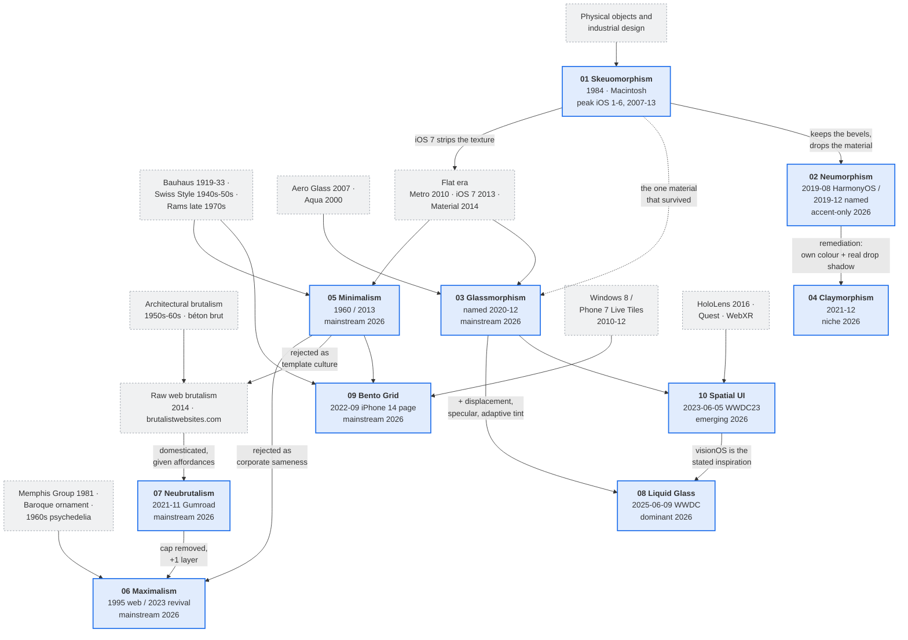

# Cross-Style Comparison Matrix

Everything in the ten style docs, flattened into comparable rows. Values are lifted from each doc's §3 Visual DNA and §4 Anatomy sections; verdicts in the combination grid are reconciled from each doc's §12 Hybrids & Neighbors. Research date for all inputs: **2026-08-08**.

Short codes used throughout: **SK** skeuomorphism · **NE** neumorphism · **GL** glassmorphism · **CL** claymorphism · **MI** minimalism · **MX** maximalism · **BR** brutalism · **LG** liquid-glass · **BG** bento-grid · **SP** spatial-ui.

---

## 1. Visual signature

| Style | Defining CSS declaration | Radius | Shadow language | Blur | Palette temperament |
|---|---|---|---|---|---|
| **SK** Skeuomorphism | `box-shadow: 0 1px 2px rgba(0,0,0,.25), 0 4px 10px rgba(0,0,0,.18), inset 0 1px 0 rgba(255,255,255,.80), inset 0 -2px 3px rgba(0,0,0,.12)` over a 3-stop vertical gradient | 8–12px moulded plastic/metal, 2–4px machined, 16–24px rubber | Four layers: contact + ambient outer, bevel + lip inset. Recessed wells invert the stack. | 0 (grain instead: `feTurbulence` fractalNoise, baseFreq 0.9, 2 octaves, α 0.04–0.06) | Warm desaturated materials — tans, leather browns, brushed greys, felt greens. Sat 8–25%, L 82–95% for faces. Never `#fff`, never `#000`. |
| **NE** Neumorphism | `box-shadow: 8px 8px 16px #b8b9be, -8px -8px 16px #ffffff` on a fill identical to the parent | 14px control, 24px card, 36px slab; generator default ≈ size/6 | Exactly two mirrored layers, `blur = 2 × distance`, `spread = 0`. Four shape states: flat / concave / convex / pressed. | 0 | Near-neutral mid-tones, OKLCH chroma < 0.03. Base must have luminance headroom both ways: `#e6e7ee` light, `#2a2e39` dark. |
| **GL** Glassmorphism | `backdrop-filter: blur(20px) saturate(160%)` over `background-color: rgba(255,255,255,0.14)` with a 1px light border | 16px card, 24–28px sheet, 999px pill | Soft, wide, negative-spread: `0 8px 32px -8px rgba(0,0,0,.38)`, plus `inset 0 1px 0 rgba(255,255,255,.35)` | **8–40px**, scaled to z-elevation not to element size | Cool and thin. Fill 6–22% alpha on dark grounds; requires a vivid structured backdrop (mesh gradient, photo, aurora) as a hard dependency. |
| **CL** Claymorphism | `box-shadow: inset 0 10px 18px -6px hsl(0 0% 100%/.62), inset 0 -10px 18px -6px hsl(258 45% 30%/.32), 0 24px 44px -12px hsl(258 60% 45%/.32)` | **32px card, 20px button, 40px modal, 999px chip** — the fattest in the set | Three layers: light inset top, dark inset bottom, one large hue-matched drop. Squircle geometry (Figma corner smoothing 60–100%). | 0 on the surface (44–68px shadow blur; the original generator also emitted `backdrop-filter: blur(5px)`) | Pastel-to-candy: L 70–90%, sat 20–60%. Lavender, sky, mint, butter, coral on a tinted off-white `#F4F1FB`. |
| **MI** Minimalism | `background: #fff; border: 1px solid rgb(0 0 0 / 0.08); border-radius: 8px; box-shadow: none` | 6–10px (0px for hard-Swiss, 999px pills only); never varies by component | At most two steps, both < 8px blur and < 8% opacity. Hairline borders do the work elevation does elsewhere. | **0px, declared explicitly** — `--min-backdrop-blur: 0px` is the contract that separates it from glass | Achromatic: 90–95% of pixels at OKLCH chroma ≤ 0.02, exactly one accent hue, a second only for destructive semantics. |
| **MX** Maximalism | `box-shadow: 4px 4px 0 #FF2E88, 8px 8px 0 #00E5FF, 12px 12px 0 #0B0A0F; border: 3px solid #0B0A0F; rotate: -1.5deg` | Deliberately mixed in one composition: 0px hard rect beside 999px pill beside a `42% 58% 63% 37% / 51% 42% 58% 49%` blob | Zero-blur, often stacked in three colours. Blur radius 0 is the tell. | 0 (blend modes instead: `multiply`, `difference`, `screen`) | 4–7 hues at OKLCH chroma 0.18–0.30, deliberately non-analogous, anchored by one near-black ink and one off-white paper. Note the 2025-26 refinement toward near-monochrome grounds with selective colour pops. |
| **BR** Brutalism | `border: 2px solid #000; border-radius: 0; box-shadow: 4px 4px 0 0 #000` — hover translates by exactly the offset and drops the shadow | **0px** (neobrutalism.com) or **5px** (ekmas). Both dialects in active use; ≥ 12px becomes claymorphism. | One hard offset, blur and spread both exactly 0. Six-step scale 1px → 16px. Shadow colour is the border token. | **0, categorically** — the absence of blur is as diagnostic as the presence of the shadow | Flat saturated fills on a warm cream ground `#FEF6E4`. Yellow `#FFDC58`, lime `#A3E635`, pink `#FF6B9D`, cyan `#67E8F9`. Max 2–3 accents per screen. |
| **LG** Liquid Glass | `backdrop-filter: url(#lg-refract) blur(20px) saturate(180%) brightness(108%)` with `<feDisplacementMap scale="48">` | 999px capsule for controls, 26px card, 38px sheet; continuous curvature, concentric with the window corner | Separation, not an elevation ladder: one `0 8px 32px rgba(0,0,0,.12)` ambient plus a tight contact shadow. Plus a 1–2px specular rim arc at ~135°. | **20px default, 0–28px** on top of the displacement pass | Adaptive — the surface samples backdrop luminance at runtime and flips its own fill and foreground. Fill α ≥ 0.55 hard clamp, 0.62 default. |
| **BG** Bento Grid | `grid-template-columns: repeat(12, minmax(0,1fr)); grid-auto-rows: 180px; gap: 16px` with tiles at `span 6 / span 2` | **24px on every tile, uniform**; nested media at `outer − padding` | Almost none at rest: `0 1px 2px rgba(0,0,0,.04)`. Separation comes from the gap, not the shadow. | 0 (and at most one `backdrop-filter` element per section) | Very low surface delta — page `#ffffff` / tile `#f5f5f7` light, `#000000` / `#161617` dark. The layout is the style; the palette is borrowed. |
| **SP** Spatial UI | `perspective: 1200px; transform: translateZ(56px) scale(calc(1 - 56/1200))` | 32px panel (Android XR default); concentric, continuous corners | Depth-proportional **pairs** at every step: `0 12px 28px -8px rgba(12,14,22,.26), 0 48px 96px -32px rgba(12,14,22,.42)` at level 5. Single-shadow elevation reads as flat design. | 24–40px on panels, saturate 165% | Environment-sampling glass with 3 vibrancy tiers. Panel α 0.72 owned backdrop / ≥ 0.83 arbitrary. Quiet by necessity — depth is the loud channel. |

**Depth taxonomy, compressed.** Five of the ten produce depth and they do it five different ways: SK casts light onto a textured object; NE extrudes a shape out of its own background; CL inflates a coloured object and floats it; GL/LG put a transparent plane between you and the content; SP moves the plane on a real z-axis. MI, MX, BR and BG have no depth model at all — MI deletes it, MX and BR replace it with a hard graphic offset, BG replaces it with a gutter.

---

## 2. Cost

| Style | Implementation difficulty | Perf cost | A11y risk | Maintenance burden | Designer skill needed |
|---|---|---|---|---|---|
| **SK** | **High** — four shadow layers, a 3-stop gradient, a grain layer and a specular hotspot must all agree on one light direction | **Medium** — 4 blurred shadow layers per control plus one SVG grain layer per scroll container; budget ≤ 60 KB decorative image bytes per route | **Medium** — the decorative hairline (`#b8a98e`-class, ≈1.76:1) never meets 1.4.11, so a second much darker border token is mandatory. `forced-colors` nulls `box-shadow`, `text-shadow` **and** `background-image` but **not** `url()` backgrounds, so the grain layer needs an explicit `display:none`. | **High** — no open-source React/Vue component library exists at shadcn/Radix scale; everything findable is Figma files and CodePen one-offs, so you own the whole surface | **High** — material judgement (which radius reads as which substance) is not derivable from tokens |
| **NE** | **Medium** — two shadows and one arithmetic rule (`blur = 2 × distance`) | **Medium** — two blurred shadows per control; fail above 24 neumorphic elements per route, warn above 12 | **High, structurally** — no value of blur, distance or luminance delta gets a same-hue pair to 3:1; measured pairs are 1.23–1.59:1. `forced-colors` deletes `box-shadow`, which deletes 100% of the visual structure, including any box-shadow-based focus ring. | **Medium** — the ecosystem is frozen (`ui-neumorphism` last npm release 2021-02-21, `tailwindcss-neumorphism` 2020-06-10); the best-maintained libraries are SwiftUI and Compose, not web | **Medium** — the hard part is discipline about coverage, not craft |
| **GL** | **Medium** — one declaration plus a mandatory `@supports` fallback and a controlled backdrop | **Medium** — each `backdrop-filter` element is a backdrop snapshot per frame; cap at 3 surfaces / 30% blurred area on mobile, 5 / 50% on desktop | **High** — an identical `rgba(255,255,255,0.12)` panel measures 14.6:1 over `#0B0B12` and 1.57:1 over `#7DD3FC`, a 9.3× swing on one component. A dark text scrim needs α ≥ 0.558 to guarantee 4.5:1 against a worst-case white backdrop. Safari does not implement `prefers-reduced-transparency`, so an in-app toggle is required. | **Low** — one token ladder, well-supported, several maintained libraries | **Medium** — most of the work is choosing and controlling the ground |
| **CL** | **Medium** — three shadows plus a rim light, all hue-derived from each element's own fill | **Medium** — 44–68px blur radii are the main lever; fail above 4 shadow layers per selector or 48px blur on a list item | **Medium** — clay's independent surface colour is what restores the contrast neumorphism lost, so the base is passable; but `forced-colors` deletes `box-shadow` and clay's boundaries *are* the shadow | **Medium** — canonical tooling is dead (`tailwindcss-claymorphism` peer-locked to `tailwindcss ^3.1.6`, no v4 support, last release 2022-10-29); surviving distribution is the tweakcn shadcn theme, which ships no inset stack at all | **Medium–High** — hue-matched shadows and a consistent light source, or it looks cheap |
| **MI** | **Medium** — trivial to draw, hard to keep usable | **Low** — the cheapest to paint; fail the build above a 40 KB CSS delta | **Medium** — the failure is deleted affordance, not colour. `#737373` is 4.74:1 on white (the lightest legal body grey); `#999999` is 2.85:1; the exact 3:1 boundary on white is `#949494`, so the ubiquitous `#E5E5E5` hairline (1.26:1) can never be a control's only affordance. WCAG 2.2's 2.5.8 and 2.4.11 land squarely on icon-only ghost controls and thin sticky headers. | **Low** — tokens only; dark mode is nearly free because there is no material to re-simulate | **High** — subtraction with compensation is the hardest judgement in the set |
| **MX** | **High** — three planes, four typefaces, blend modes, and a hard budget rule holding it together | **High** — but almost entirely fonts, imagery and blend modes: zero-blur hard shadows are genuinely cheaper to paint than glass or neumorphic ambient shadows. Cap font payload at 180 KB; emit no raster noise or pattern assets. | **High** — half the accent palette is decoration-only on any given ground and which half flips with the theme (lime 16.63:1 on ink but 1.12:1 on cream; orange on cream 2.70:1 fails even the 3:1 non-text bar). Three of WCAG 2.2's nine new criteria (2.4.11, 2.4.13, 2.5.8) target rotated floating ornament directly. | **High** — bespoke by construction; every campaign is a new composition | **Very high** — this is the style where a weak designer produces the worst result in the set |
| **BR** | **Low** — a border, an offset, a flat fill | **Low** — `box-shadow` paint cost scales with the square of the blur radius and blur is exactly 0, so a hard shadow costs about what a `background-color` fill costs. The best pick in the set for low-end Android. Emit ≤ 8 KB CSS, 0 KB JS. | **Medium** — contrast is usually excellent (black on `#FFDC58` is 15.6:1, AAA). The real failures are `forced-colors` deleting the shadow (hence "border AND shadow, never shadow alone") and SC 1.3.2 Meaningful Sequence broken by rotated absolutely-positioned collage. The reference library also ships `--border: oklch(0% 0 0)` in dark mode, ≈1.6:1 against its own dark surface. | **Low–Medium** — the reference library was archived 2025-07-19; the maintained successor is neobrutalism.com, which ships a hosted MCP server for agent installs | **Low** — the most forgiving style here |
| **LG** | **High** — a displacement map, a specular mask, a three-tier `@supports` ladder, and a runtime tint | **High** — SVG displacement plus backdrop sampling plus saturation, per surface. Cap at 3 glass surfaces per route and 25% of a 1440×900 viewport; displacement maps ≤ 8 KB each, inlined. Nested glass is a hard fail — Apple's own renderer cannot sample glass with glass, which is why `GlassEffectContainer` exists. | **High** — below ≈46% fill alpha no foreground colour whatsoever passes 4.5:1 across all possible backdrops (pure black crosses at α ≈ 0.455, the shipped `#1C1C1E` ink at ≈ 0.515), and nothing below ≈55% passes with any margin. Apple's own opacity floor moved from ≈40% (iOS 26) to ≈60% (iOS 27) after an American Foundation for the Blind open letter in December 2025. | **Medium on Apple platforms** (the OS renders it), **High on the web** — no interoperable primitive exists; W3C SVG WG issue #1142 was filed 2026-06-25 with no browser positions | **High** — getting the lens profile right matters; Apple's is closer to a convex squircle `y = ⁴√(1−(1−x)⁴)` than a spherical dome |
| **BG** | **Low** — one grid declaration and a span vocabulary | **Low** — CSS Grid is a single cheap layout pass. Every real bento performance problem comes from tile *contents*: per-tile `backdrop-filter`, per-tile autoplaying video, unsized screenshots served at desktop 2× to phones. Warn above 600 KB of image bytes, fail above 1.2 MB. | **Medium** — the hairline `rgba(0,0,0,0.06)` on `#f5f5f7` composites to `#e6e6e8` for 1.14:1, fine as decoration and an outright 1.4.11 failure the moment the tile is the control. `grid-auto-flow: dense` remains a real 1.3.2 / 2.4.3 hazard because `reading-flow` shipped only in Chrome 137 and is not Baseline. | **Low** — plain CSS Grid; the layout will outlive every library | **Low** — the only real skill is deciding what the hero tile says |
| **SP** | **High** — a camera, a counter-scale, a six-step ladder, and parallax that must detach under reduced motion | **Medium** — cap concurrent `backdrop-filter` surfaces at 6, composited layers at 25, `preserve-3d` nesting at 3, permanent `will-change` at 0, GPU layer memory at 96 MiB | **High** — dark glass at the conventional α = 0.72 gives only 3.13:1 for white text over a worst-case white backdrop; the real minimum is α ≥ 0.83. SC 2.5.7 Dragging Movements is the criterion this style breaks most reliably and that nobody discusses: every `movable()`/`resizable()` panel needs a non-drag alternative. | **High** — `androidx.xr.compose` was `1.0.0-alpha16` on 2026-07-15, no stable release, breaking changes in July 2026; pin an explicit alpha or the code rots | **High** — the numbers are published (Android XR gives 0.868 dp-to-dmm, a 41° cone, a 0.75–5 m band) but the spatial reasoning is not common skill |

---

## 3. Fit

| Style | Best product categories | Worst product categories | Audience skew | Brand personality |
|---|---|---|---|---|
| **SK** | Audio plugins and DAWs, instrument panels, camera apps, automotive HMI, creative tools, hardware companion apps, deliberately retro consumer products | Content-heavy reading surfaces, data tables, admin dashboards, anything with more than ~120 characters of running text on the textured surface | Skews older and prosumer; strongly associated with musicians, photographers and drivers rather than with a demographic | Crafted, authoritative, expensive, physical. Says "a person machined this." |
| **NE** | Smart-home and appliance controls, thermostats, media transport, calculators and clocks, wellness/meditation, sleep and health trackers, single-purpose utilities, portfolio work | Anything information-dense; forms; e-commerce; enterprise; any product with a legal accessibility obligation | Design-forward consumers; the style reads as "concept app" to practitioners | Calm, quiet, clinical, premium-hardware. Says "this is a nice object" and almost nothing else. |
| **GL** | Floating and transient chrome — navbars, command palettes, popovers, media HUDs, modals; media-rich consumer apps; anything over a controlled photographic or gradient ground | Forms, data tables, long-form content surfaces, any UI over user-uploaded imagery or third-party iframes | Broad and platform-neutral; every major OS ships a version, so it reads as "modern default" rather than as a statement | Light, contemporary, layered, slightly luxurious. Depth without commitment. |
| **CL** | Kids' apps, edtech, gamified habit and chore trackers, friendly fintech onboarding, wellness, Spline/Blender-driven 3D landing pages, celebration states | Financial statements, medical records, admin dashboards, B2B enterprise, anything where credibility is the conversion barrier | Skews young, or adults being addressed playfully; parents choosing for children | Friendly, safe, toy-like, slightly childish. That last quality is exactly why it works in some products and destroys others. |
| **MI** | Developer tools, B2B SaaS, documentation, editors, finance, AI chat surfaces, dashboards, anything read for hours | Products competing on personality; campaign pages; consumer entertainment; any surface where being forgettable is the failure mode | Professionals and repeat users; skews toward people who value speed over delight | Confident, quiet, competent, content-first. In 2026 it also reads as a deliberate anti-AI-theatrics stance ("calm interface"). |
| **MX** | Brand and campaign pages, launch moments, music, food and beverage, fashion, creator tools, Gen-Z consumer, celebration and upgrade surfaces | Task-oriented app shells, checkout flows, forms, error states, charts, tables — the practitioner consensus is explicit context-gating | Gen-Z and culture-forward audiences; also art directors, who are the secondary audience for every maximalist site | Loud, human, confident, unmistakable. Says "a person with taste and nerve made this, not a component library." |
| **BR** | Creator tools, dev tools, indie SaaS marketing, portfolios, editorial, Gen-Z commerce, anything that must not look AI-generated | Dense enterprise UI (accent-only there), regulated industries, luxury, anything where "cheap-in-a-good-way" is the wrong read | Indie, technical and Gen-Z audiences; the style is now saturated enough that practitioners notice it | Raw, cheap-in-a-good-way, tactile, hand-built. The 2026 commercial argument is differentiation from AI-generated sameness. |
| **LG** | Apple-platform apps of any kind (you are opted in by default), Apple-adjacent web marketing, media-rich consumer chrome | Cross-browser web products, data-dense apps, anything on user-supplied backdrops, anything that must render identically in Safari and Chrome | Apple users, who now see it system-wide; on the web it reads as an Apple homage | Premium, optical, precise, slightly cold. Also, in 2026, slightly controversial — a Gold Cube at the ADC awards and a hostile forum reception at the same time. |
| **BG** | Feature sections, marketing pages, dashboards, overview screens, portfolio indexes, spec comparisons, personal dashboards | Sequential flows, forms, long-form reading, anything where reading order matters and `dense` packing is tempting | Universal; it is the safe default, which is precisely its 2026 problem | Premium density, composed, organised. Says "we have a lot to tell you and we are calm about it" — and, in 2026, "we used the same template as everyone else." |
| **SP** | visionOS and Android XR apps; on flat screens: product marketing, portfolios, onboarding, anything selling a sense of dimension | Dense productivity UI, tables, forms, mobile-first task apps, low-end devices | Early adopters and design-forward audiences; the native XR install base is small and shrinking (IDC counted ~45,000 Vision Pro units in 2025 vs 390,000 in 2024) | Futuristic, spacious, calm, expensive. A design vocabulary that outgrew its hardware. |

---

## 4. Trajectory

| Style | Origin | Peak | Status 2026 | 5-year outlook (to 2031) |
|---|---|---|---|---|
| **SK** | 1984 (Macintosh desktop metaphor) | 2007–2013 (iOS 1–6) | **Revival, narrow.** Every trend roundup lists texture and material depth as ascendant, but Superdesign's telemetry over 208,000+ real UI generations (Jan–Jun 2026) shows skeuomorphism never exceeded **0.1%** — 71 projects, 113 prompt mentions total. | Stable and small. Material realism keeps growing at the OS layer while object-mimicry stays a deliberate niche. The Euro NCAP push (January 2026) gives automotive HMI a durable, non-nostalgic reason to keep bevels. Watch Apple: the iOS 27 correction moved *toward* skeuomorphism — darker edges, brighter speculars. |
| **NE** | 2019-08 (Huawei HarmonyOS / Honor Vision tiles, months before the Dribbble shot) | 2019-12 → 2021-06 | **Accent-only.** Dead as a whole-interface language: no OS, design system, or top-1000 web property ships a fully neumorphic UI. Alive as one component class at a time inside a flat or glass shell. | Continued decline as a web style; survival as a native-platform effect. The highest-starred neumorphic repo with genuine 2026 activity is Android/Compose (`fornewid/neumorphism`, 1,017 stars, pushed 2026-05-28), because native platforms lack an inner-shadow primitive and therefore need a library at all. |
| **GL** | 2020-12 (Malewicz names it; Vista Aero 2007 and iOS 7 2013 are the substrate) | 2020–2022, then again 2025–2026 | **Mainstream, demoted.** Every major OS ships a blurred-translucency material, which is the definition of mainstream; the design press has simultaneously turned on decorative use. The honest position: default for floating transient chrome, bad default for content. | Becomes invisible infrastructure. `backdrop-filter` reaches Baseline *widely available* on **2027-03-16**, at which point the `@supports` dance stops being interesting and glass stops being a "style" at all. |
| **CL** | 2021-12 (Malewicz, *Claymorphism in User Interfaces*) | 2021–2023 | **Niche, growing from a rounding error.** Superdesign telemetry: **0.03% of generations in January 2026 → 0.08% in May 2026**. Concentrated in kids' products, edtech and illustration-heavy landing pages. | The illustration half outlives the interface half. Clay-rendered 3D icon packs are reported at peak adoption in 2026 icon surveys while the CSS surface style sits at niche; expect that gap to widen. |
| **MI** | 1960 as art movement; late 1970s for Rams' principles; 2013 for the flat UI era | 2013–2020 | **Mainstream, no longer the platform default.** Apple moved to Liquid Glass (WWDC 2025), Google to Material 3 Expressive (May 2025, backed by ~3 years, 46 studies and 18,000+ participants). Minimalism now dominates developer tools, B2B SaaS, docs and AI chat, rebranded as "calm interface" / "quiet UI". | Permanent. It is the only style here that has survived multiple full cycles, and the 2026 anti-AI-theatrics framing gives it a fresh motivation. Expect the label to keep changing while the tokens do not. |
| **MX** | 1995 (accidental web maximalism); Memphis Group 1981 as the design ancestor | 2023–2026, still climbing | **Mainstream on brand surfaces.** 1stDibs' ninth Interior Designer Trends Survey (2025-11-17, n=468) puts maximalism at **39%** of most-requested styles, up from 34% in 2023. Pinterest Predicts 2026 shows "80s luxury" +225%, "maximalist accessories" +105%. | Bifurcates further. Award-circuit maximalism is already real-time 3D and scroll-driven cinematics rather than flat collage, with heavy video backgrounds visibly in decline; flat collage maximalism settles permanently into brand and campaign pages. Stated qualitatively on purpose — no renderer-share figures are quoted, because the breakdown this cell used to carry came from a source with no published methodology and a sample size inconsistent with Awwwards awarding one Site of the Day per day. Re-derive from the Awwwards archive before quoting any number, and define the sample. |
| **BR** | 2014 (brutalistwebsites.com); 2021-11 for the neubrutalist commercial inflection (Gumroad) | 2022–2026 | **Mainstream, quietly still growing.** Two forces keep it alive past its predicted expiry: it is the cheapest way to look non-generic, and it has a genuinely low implementation cost. | Saturation is the risk, not obsolescence. The style is durable because it is cheap; expect it to keep drifting toward the "quiet brutalism" dialect (1 accent, 2px borders, generous whitespace) that survives inside serious products. neobrutalism.com's hosted MCP server is a signal of where distribution goes next. |
| **LG** | 2025-06-09 (WWDC), shipped 2025-09-15 | 2025–2027 | **Dominant on Apple platforms** — not because it is loved but because it is the default rendering of every recompiled app and the opt-out is on a removal schedule. Mainstream-as-accent on the web, with a hard portability ceiling. | Apple keeps sanding it down: beta-cycle opacity increases (June–July 2025), the Clear/Tinted toggle (2025-11-03), and a continuous opacity slider plus darkened edges in iOS 27 (2026-06-08). Google publicly ruled it out for Android 17 on 2026-05-06. Expect a quieter, higher-opacity Liquid Glass and no cross-platform convergence. |
| **BG** | 2022-09 (iPhone 14 product page; WWDC 2022 M2 spec slides) — **not** WWDC 2023, which was amplification | 2023–2025 | **Mainstream and undifferentiating.** Creative Boom's "10 trends creatives are so over in 2026" (2026-04-21) ranks it #9, with the practitioner quote "Bento boxes… but can't stop using them." | Becomes plumbing, which it already largely is. The interesting movement is toward animated and rearrangeable bento rather than away from the layout. The structural blocker is native: neither SwiftUI Grid nor Compose `LazyVerticalGrid` supports row spanning, so true 2D bento on native still needs nested stacks or a custom `Layout`. |
| **SP** | 2023-06-05 (WWDC23 "Design for spatial user interfaces" — the founding document of the style as a system) | 2024–2027 | **Emerging and bifurcated.** The native XR dialect has excellent documentation and a shrinking install base; the flat-screen dialect is spreading fast. IDC expected overall MR/VR shipments to fall **42.8%** in 2025 while smart glasses grew **211.2%**. | The design language survives the hardware. Note what the web is actually standardising: Interop 2026's nineteen focus areas include scroll-driven animations, view transitions and anchor positioning — **WebXR is not among them, nor among the four investigation areas**. Those are exactly the primitives the flat-screen dialect needs. |

---

## 5. Combination matrix

Read the row style as the **base layer** and the column style as the **added layer**, then check the notes — several verdicts are directional.

**Legend:** ✅ works — ⚠️ careful, works only under a stated constraint — ❌ clashes, do not combine — ▩ disputed, the two docs give opposite verdicts (see notable combos) — — same style.

| | SK | NE | GL | CL | MI | MX | BR | LG | BG | SP |
|---|:--:|:--:|:--:|:--:|:--:|:--:|:--:|:--:|:--:|:--:|
| **SK** Skeuomorphism | — | ❌ | ✅ | ⚠️ | ⚠️ | ✅ | ⚠️ | ⚠️ | ▩ | ⚠️ |
| **NE** Neumorphism | ❌ | — | ▩ | ❌ | ❌ | ❌ | ❌ | ❌ | ▩ | ❌ |
| **GL** Glassmorphism | ✅ | ▩ | — | ▩ | ✅ | ❌ | ❌ | ⚠️ | ✅ | ✅ |
| **CL** Claymorphism | ⚠️ | ❌ | ▩ | — | ❌ | ⚠️ | ❌ | ⚠️ | ⚠️ | ✅ |
| **MI** Minimalism | ⚠️ | ❌ | ✅ | ❌ | — | ✅ | ✅ | ✅ | ✅ | ✅ |
| **MX** Maximalism | ✅ | ❌ | ❌ | ⚠️ | ✅ | — | ✅ | ❌ | ✅ | ❌ |
| **BR** Brutalism | ⚠️ | ❌ | ❌ | ❌ | ✅ | ✅ | — | ❌ | ✅ | ❌ |
| **LG** Liquid Glass | ⚠️ | ❌ | ⚠️ | ⚠️ | ✅ | ❌ | ❌ | — | ⚠️ | ✅ |
| **BG** Bento Grid | ▩ | ▩ | ✅ | ⚠️ | ✅ | ✅ | ✅ | ⚠️ | — | ⚠️ |
| **SP** Spatial UI | ⚠️ | ❌ | ✅ | ✅ | ✅ | ❌ | ❌ | ✅ | ⚠️ | — |

**Score summary.** Minimalism is the most combinable style in the set — 6 ✅ against 2 ❌ (neumorphism and claymorphism, both of which need the low-contrast soft surfaces minimalism forbids) — because it supplies structure without claiming a material. Neumorphism is the least combinable: 0 clean ✅, 7 ❌ and 2 disputed, because its same-hue premise contradicts every other style's premise. Glassmorphism, maximalism, bento and spatial UI tie at 4 ✅ each, and in every case the ✅ partners are styles that supply what the other one lacks — structure for the expressive styles, surface for the structural ones.

### Notable combos

**✅ The five that are worth building**

1. **SK + GL — "glass above, material below."** This is literally what Liquid Glass is: a translucent refractive layer over opaque bevelled hardware. Reverse it (opaque hardware on top of glass) and the depth model breaks. Cap it at two backdrop-filtered layers, blur ≤ 12px, and ship an opaque fallback under `prefers-reduced-transparency`.
2. **MI + BR — "Swiss brutalism" / "quiet brutalism."** Both docs independently arrive here. Radius `0`, `1px solid #000` at 21:1, no shadows, one loud accent, generous whitespace. It is the most defensible way to make a minimal system distinctive, and it is how brutalism survives inside serious enterprise products.
3. **MX + BR — the best pairing in the maximalism doc.** Neo-brutalism is effectively maximalism with the layer count capped at two: it already supplies the 6px stroke, the zero-blur offset and the saturated flat fills. Start there and add exactly one layer (pattern, grain, or ornament — not all three).
4. **GL + SP — the required partnership.** Spatial UI owns `perspective`, `translateZ`, counter-scale and shadow pairing; glassmorphism owns `background`, `backdrop-filter` and the hairline. Almost every real spatial implementation is both. Keep the α ≥ 0.83 contract for arbitrary backdrops and this is the single most productive hybrid in the set.
5. **MI + SP — the pairing that ships most often and ages best.** Depth is a loud hierarchy channel and only reads if the surfaces are quiet: a minimalist type scale, a two-colour palette and generous whitespace let the z-axis do all the ranking work.

**⚠️ The interesting constrained cells**

6. **MX + BG — "editorial bento," the surprising fit.** Bento is the strongest *container* for maximalist content precisely because the fixed gutter and uniform radius supply the structure maximalism refuses to supply itself. Load the tiles with clashing colour, collage and heavy type; keep the grid rigid.
7. **GL + BG and LG + BG — same constraint, different cost.** Apply the blur to the **grid container** as one surface with opaque internal dividers, never to each tile. A 3×3 bento of glass tiles is nine backdrop snapshots per frame; the same grid in Liquid Glass is nine displacement passes, which is worse.
8. **LG + SP — native pairing, brutal combined cost.** visionOS is where Liquid Glass came from, so the composition is authentic, but SVG displacement + backdrop sampling + a 3D transform is three GPU-expensive mechanisms on one element. Use Liquid Glass on exactly one surface (the orbiter) and plain glass on the panels.
9. **CL + SP — surprisingly good.** Opaque soft-shadowed clay objects on a real depth ladder read as toys on shelves, which is a coherent metaphor, and clay's chunky 60px+ forms already clear visionOS's 60pt gaze targets. Keep the clay opaque.
10. **GL + LG — succession, not hybrid.** Mixing both in one product looks like two design eras colliding. Pick one per surface class: plain glass where you need cross-browser predictability, Liquid Glass on Apple platforms where the OS renders it for you.

**❌ The ones to refuse outright**

11. **NE + CL — named "the single worst combination in this doc set."** A same-coloured extruded element beside a floating coloured one destroys the reader's model of where the light and the ground plane are. If you want recesses in a clay system, use clay's own inverted inset recipe for inputs.
12. **NE + anything with a vivid or varying ground** (MX, GL over gradient, SP). Neumorphism's shadows land on a moving backdrop and read as dirt, and its low-contrast affordance disappears against pattern. Two a11y-hostile systems compound rather than average.
13. **BR + LG — "clashes hardest in the set."** Liquid Glass is refraction, specular highlight and continuous curvature; neubrutalism defines itself by having none of those. On Apple platforms, keep brutalism inside your own content views and let the platform chrome stay glass.

**▩ The four cells where the docs disagree**

14. **NE × GL.** Doc 02 calls glassmorphism neumorphism's *best partner* — neumorphic base plane, glass overlays, unambiguous z-order, and glass fixes neumorphism's 1.4.11 problem because a glass panel has a real background differential and a real border. Doc 03 calls it a *direct conflict* — neumorphism needs an opaque mid-tone monochrome ground, glass needs translucency and a vivid one. **Resolution:** both are right about different arrangements. Neumorphic ground + glass overlay works; glass *inside* a neumorphic well does not, because the well's inset shadow shows through the blur and reads as a rendering bug.
15. **NE × BG.** Doc 02 calls it *structurally excellent* (uniform generously-gapped cells are exactly what neumorphism wants; keep the gap ≥ 24px so shadow halos do not merge). Doc 09 says *clashes* — bento's premise is compartments separated by a visible gutter, neumorphism's is tiles the same colour as the page, giving a grid of near-invisible boundaries. **Resolution:** doc 09 has the stronger argument for a marketing bento where tiles must read as distinct compartments; doc 02's version only works for a control panel where the "tiles" are single extruded controls, not content containers.
16. **SK × BG.** Doc 01 calls it *works well* — skeuomorphic cells in a bento grid is essentially a rack of modules, provided every cell shares one elevation and light direction. Doc 09 says *only as tile content* — a materially-rendered object inside a flat tile is strong, but stitched-leather tile chrome is a 2011 joke. **Resolution:** doc 09's split is the safer default; doc 01's is defensible only for hardware-metaphor products where the whole page is a chassis.
17. **GL × CL.** Doc 03 says *clashes* — clay is chunky opaque volume, glass is thinness and transparency, and side by side they read as inconsistent material physics. Doc 04 says *works, and was in the original recipe* — Malewicz's own claymorphism generator emits `backdrop-filter: blur(5px)`. **Resolution:** the coiner's generator settles the historical point, but doc 03's product advice holds: glass for overlays and nav, clay for opaque pressable objects, and never a translucent clay surface, because the insets need an opaque body to shade.

### Rules that hold across every pair

- **The loud-layer budget is shared, not per-style.** Pairing two expressive styles does not give you six layers. Three overlapping planes in one viewport is the ceiling.
- **One style owns the interactive controls, for the whole product.** Mixing a glass button and a hard-shadow button in one view destroys the affordance vocabulary faster than any amount of decoration.
- **The rule of one for glass.** In a single product, glass — plain or liquid — is the treatment for exactly one layer of the z-stack. Chrome or overlays, not both, and never content.
- **Every combination shares one light source.** SK, NE, CL and SP all encode a light direction. If two of them disagree, the composite reads as a bug, not as a hybrid.
- **The performance fix and the accessibility fix usually point the same way.** Dropping a blend mode, a grain layer, or a shadow layer removes exactly one loud layer, which is also the usability remedy. This is unusual and worth exploiting in tooling.

---

## 6. Family tree

Lineage, not chronology: an arrow means "this style is a reaction to, or a technical descendant of, that one."



**Four lineage claims worth stating explicitly, because they are commonly got wrong:**

- **Skeuomorphism → flat/minimalism → glassmorphism → Liquid Glass** is the main trunk, and it is a loop rather than a line. iOS 7 (2013) removed simulated material; Liquid Glass (2025) restored it in optical rather than textural form; the iOS 27 correction (2026-06-08) added *darkened edges and brighter specular highlights* — the fix for a legibility complaint was more bevel, not less material.
- **Neumorphism and claymorphism are both skeuomorph descendants, in sequence, not in parallel.** Neumorphism kept the bevels and threw away the material metaphor and the borders, which is exactly why it fails 1.4.11. Claymorphism is a direct remediation of that failure: same soft-shadow vocabulary, but the element gets its own colour and a real drop shadow, which is what restores the contrast.
- **Brutalism is an anti-minimalism reaction, and maximalism is brutalism with the cap removed.** Raw web brutalism (2014) rejected template polish; neubrutalism (2021) domesticated it by adding back the affordances; maximalism takes the same saturated flat fills and hard offsets and adds the third plane.
- **Liquid Glass has two parents, not one.** It descends technically from glassmorphism (translucent fill + blur) and conceptually from spatial UI — Craig Federighi has said visionOS is the direct inspiration. That is why the SP ↔ LG edge points both ways in practice.

---

## 7. Shared token-naming convention

All ten docs currently emit their own prefix (`--sk-*`, `--nm-*`, `--glass-*`, `--clay-*`, `--min-*`, `--max-*`, `--nb-*`, `--lg-*`, `--bento-*`, `--sp-*`); four were internally inconsistent and are now reconciled — three (docs 03, 07 and 01) carried a second token prefix inside their §5 recipes, and a fourth (doc 05) mismatched its §4 table against its §4 CSS. See the notes under §7.4 Rules 2 and 1 respectively. This section defines the single namespace they converge on, so that two styles can coexist in one stylesheet, a validator can check any doc's tokens with one regex, and the marketplace skills can emit and consume tokens mechanically.

### 7.1 The grammar

```
--um-<style>-<group>[-<variant>]
```

One `--um-` root (ui-morphism), then the style segment, then a group word from the fixed vocabulary, then an optional variant or step.

```css
--um-skeuomorphism-shadow-1
--um-neumorphism-border-strong
--um-glassmorphism-blur-2
--um-liquid-glass-radius-pill
--um-bento-grid-space-4
--um-spatial-ui-elev-5
```

Matching regex: `^--um-(skeuomorphism|neumorphism|glassmorphism|claymorphism|minimalism|maximalism|brutalism|liquid-glass|bento-grid|spatial-ui)-[a-z]+(-[a-z0-9]+)?$`

### 7.2 Style segments (10, verbatim from each doc's frontmatter `name`)

| Doc | Frontmatter `name` | Style segment | Current prefix in the doc |
|---|---|---|---|
| 01 | `skeuomorphism` | `skeuomorphism` | `--sk-*` |
| 02 | `neumorphism` | `neumorphism` | `--nm-*` |
| 03 | `glassmorphism` | `glassmorphism` | `--glass-*` |
| 04 | `claymorphism` | `claymorphism` | `--clay-*` |
| 05 | `minimalism` | `minimalism` | `--min-*` |
| 06 | `maximalism` | `maximalism` | `--max-*` |
| 07 | `brutalism` | `brutalism` | `--nb-*` |
| 08 | `liquid-glass` | `liquid-glass` | `--lg-*` |
| 09 | `bento-grid` | `bento-grid` | `--bento-*` |
| 10 | `spatial-ui` | `spatial-ui` | `--sp-*` |

No abbreviations. The segment is the frontmatter `name` character for character, including the hyphens in `liquid-glass`, `bento-grid` and `spatial-ui`. The verbosity is deliberate: these names appear in generated code that a human reads once and a validator reads every build, and `--um-lg-*` versus `--um-gl-*` is exactly the kind of two-character collision that produces silent wrong-token bugs.

### 7.3 Group vocabulary

Every doc uses the same word for the same concept, and only these words. A concept that has no entry here does not get a token; it gets a value inline with a comment.

| Group | Variants / steps | Concept |
|---|---|---|
| `bg` | — | Page ground. The thing surfaces sit on. |
| `surface` | `-1` … `-4` | Raised or distinct planes, ascending. `surface-1` is the default card. |
| `ink` | `-muted`, `-inverse` | Foreground text and icon colour. `ink` is body-copy grade (≥ 4.5:1); `ink-muted` is still ≥ 4.5:1; `ink-inverse` is for use on `accent`. |
| `border` | `-strong` | `border` is decorative and may be below 3:1. `border-strong` is the control boundary and **must** clear 3:1 unrounded. Every style with a shadow-only affordance is required to define `border-strong`. |
| `accent` | `-fg`, `-subtle` | The single action hue, its foreground, and a low-emphasis tint. |
| `danger` | — | Destructive / error semantics. The only second hue minimalism permits. |
| `radius` | `-sm`, `-md`, `-lg`, `-pill` | Corner geometry. `-pill` is `999px`. |
| `shadow` | `-1` … `-5`, `-inset`, `-press` | Composed, ready-to-use `box-shadow` values. `-press` is the active-state stack. |
| `elev` | `-0` … `-5` | Depth *level*, semantic rather than visual. Maps to a shadow step in flat styles and to a `translateZ` step in `spatial-ui`. |
| `blur` | numeric steps where the style has a ladder | Backdrop blur radius. Explicitly `0px` in `minimalism` and `brutalism` — declaring the zero is the contract. |
| `saturate` | — | Backdrop saturation percentage. |
| `noise` | `-opacity`, `-freq` | Grain layer opacity and `feTurbulence` `baseFrequency`. |
| `space` | `-1` … `-8` | Spacing ramp. `space-4` is the 16px-class default step. |
| `font` | `-body`, `-display`, `-mono` | Family stacks. |
| `text` | `-xs` … `-3xl` | Font-size ramp. |
| `weight` | named steps | Font weights the style permits. |
| `leading` | named steps | Line height. |
| `tracking` | named steps | Letter spacing. |
| `dur` | `-fast`, `-base`, `-slow` | Transition durations. |
| `ease` | `-standard`, `-enter`, `-exit` | Timing functions. |
| `focus` | `-color`, `-width`, `-offset` | Focus indicator. Required in every style; never expressed as `box-shadow`, because `forced-colors` deletes it. |
| `target` | `-min` | Minimum hit target. Floor is 24px (SC 2.5.8); most styles set 44px. |

**Style-specific values still fit the vocabulary.** Liquid Glass's displacement scale is `--um-liquid-glass-noise-freq`'s neighbour conceptually but not the same thing, so it stays inline with a comment rather than inventing a `refract` group; spatial UI's perspective is a single value, declared inline on the stage. Resist adding groups — the vocabulary is closed on purpose so a cross-style validator can be written once.

### 7.4 The four rules every doc must follow

**Rule 1 — one set of names per doc.** The §4 token table and the §4 CSS block use identical names. No unprefixed names in the table with prefixed names in the code. *No doc violates this as of 2026-08-09. Doc 05 used to: its table said `--bg-canvas`, `--surface-1`, `--text-primary` while its CSS block said `--min-bg-canvas`, `--min-surface-1`, `--min-text-primary`. It is fixed — the table now carries the prefixed names verbatim, and its §4 preamble states that every token in the table is "the exact name emitted by the CSS block below it" and that the `--min-` prefix is collision avoidance rather than decoration. Under the convention those three become `--um-minimalism-bg`, `--um-minimalism-surface-1`, `--um-minimalism-ink`. The rule stays stated because the rename to `--um-*` is the next chance to reintroduce the split.*

**Rule 2 — §5 consumes §4, it never redeclares.** The React, Tailwind and SwiftUI recipes reference the §4 tokens. No second prefix may appear anywhere inside one doc. *No doc violates this as of 2026-08-09. Three did. Doc 03's §5 introduced `--gs-fg`, `--gs-fill`, `--gs-blur`, `--gs-sat`, `--gs-solid` alongside §4's `--glass-*`; the string `--gs-` no longer appears anywhere in doc 03. Doc 07's §5 introduced `--b-bg`, `--b-surface`, `--b-ink` alongside §4's `--nb-*`; the only `--b-` strings left in doc 07 are inside a prose changelog comment at the head of its §5 stylesheet that records the removal — that sheet now declares no tokens of its own and supplies inline fallbacks in the form `var(--nb-dur, 150ms)` rather than `--nb-dur: 150ms`, which is consumption, not redeclaration. Doc 01 carried a parallel `--skeuo-*` set in its §5 React recipe; the string `--skeuo-` no longer appears anywhere in doc 01. When the rename lands, each of these collapses into the single `--um-<style>-*` set. The rule stays stated because a component sheet that declares its own tokens is the single easiest regression to reintroduce — it renders correctly standalone and silently ignores the host theme.*

**Rule 3 — light on bare `:root`, dark duplicated under both selectors.**

```css
:root {
  color-scheme: light dark;
  --um-glassmorphism-bg: #0b0b12;
  --um-glassmorphism-surface-1: rgba(255, 255, 255, 0.10);
  --um-glassmorphism-border: rgba(255, 255, 255, 0.22);
  --um-glassmorphism-border-strong: rgba(255, 255, 255, 0.34);
  --um-glassmorphism-blur-2: 20px;
  --um-glassmorphism-saturate: 160%;
}

@media (prefers-color-scheme: dark) {
  :root:not([data-theme="light"]) {
    --um-glassmorphism-surface-1: rgba(255, 255, 255, 0.14);
    --um-glassmorphism-border-strong: rgba(255, 255, 255, 0.42);
  }
}

:root[data-theme="dark"] {
  --um-glassmorphism-surface-1: rgba(255, 255, 255, 0.14);
  --um-glassmorphism-border-strong: rgba(255, 255, 255, 0.42);
}
```

Three properties matter here. Values live on bare `:root` so a token is never defined *only* inside a media query. The media block is guarded with `:not([data-theme="light"])` so an explicit light choice wins over the OS preference. The attribute block repeats the same declarations so an explicit dark choice wins in both directions. *All ten docs emit both dark paths as of 2026-08-09; the gap that once affected docs 04, 06, 09 and 10 is closed. Every doc's §4 CSS pairs a `@media (prefers-color-scheme: dark)` block guarded with `:root:not([data-theme="light"])` against a `:root[data-theme="dark"]` block, and in every case the attribute block redeclares real tokens rather than only setting `color-scheme`. Doc 03 is the one legitimate exception to the polarity, not to the rule: glassmorphism is dark-first, so its dark values live on bare `:root`, its light override is the guarded one — `@media (prefers-color-scheme: light) { :root:not([data-theme="dark"]) }` — and the complete light list is duplicated under `:root[data-theme="light"]`. The rule is mirrored, and it says so in a comment. The rule stays stated normatively because it is the pattern every generated plugin must emit, and because a partial override — half the palette left on the other theme's values — is the bug that produces dark text on a dark scrim.*

**Rule 4 — the Tailwind v4 mirror maps group → namespace mechanically, and `@theme` is never nested.**

| Group | Tailwind v4 namespace | Generated custom property | Utilities it produces |
|---|---|---|---|
| `bg`, `surface`, `ink`, `border`, `accent`, `danger` | `--color-*` | `--color-um-<style>-<group>[-<variant>]` | `bg-*`, `text-*`, `border-*`, `fill-*`, `ring-*` |
| `radius` | `--radius-*` | `--radius-um-<style>-<variant>` | `rounded-*` |
| `shadow` | `--shadow-*` | `--shadow-um-<style>-<step>` | `shadow-*` |
| `blur` | `--blur-*` | `--blur-um-<style>-<step>` | `blur-*`, `backdrop-blur-*` |
| `space` | `--spacing-*` | `--spacing-um-<style>-<step>` | `p-*`, `m-*`, `gap-*` |
| `text` | `--text-*` | `--text-um-<style>-<step>` | `text-*` |
| `font` | `--font-*` | `--font-um-<style>-<variant>` | `font-*` |
| `weight` | `--font-weight-*` | `--font-weight-um-<style>-<variant>` | `font-*` |
| `leading` | `--leading-*` | `--leading-um-<style>-<variant>` | `leading-*` |
| `tracking` | `--tracking-*` | `--tracking-um-<style>-<variant>` | `tracking-*` |
| `dur` | `--transition-duration-*` | `--transition-duration-um-<style>-<variant>` | `duration-*` |
| `ease` | `--ease-*` | `--ease-um-<style>-<variant>` | `ease-*` |
| `elev`, `saturate`, `noise`, `focus`, `target` | none | plain custom property in `:root` | consumed via `var()` or an `@utility` |

```css
@import "tailwindcss";

/* Never nested inside @media, @layer, or any other at-rule. */
@theme {
  --color-um-brutalism-bg: #fef6e4;
  --color-um-brutalism-surface-1: #ffffff;
  --color-um-brutalism-ink: #0a0a0a;
  --color-um-brutalism-border: #000000;
  --color-um-brutalism-accent: #ffdc58;
  --radius-um-brutalism-sm: 0px;
  --radius-um-brutalism-md: 0px;
  --shadow-um-brutalism-1: 1px 1px 0 0 var(--color-um-brutalism-border);
  --shadow-um-brutalism-2: 4px 4px 0 0 var(--color-um-brutalism-border);
  --shadow-um-brutalism-5: 16px 16px 0 1px var(--color-um-brutalism-border);
  --spacing-um-brutalism-4: 16px;
  --spacing-um-brutalism-6: 24px;
  --ease-um-brutalism-standard: cubic-bezier(0.2, 0, 0, 1);
  --transition-duration-um-brutalism-base: 150ms;
}

/* Theme switching happens outside @theme, on ordinary selectors. */
:root[data-theme="dark"] {
  --color-um-brutalism-bg: #101010;
  --color-um-brutalism-border: #f5f0e6; /* never #000 on a dark surface: ~1.6:1 */
}
```

The last line is the reason Rule 4 exists as a rule rather than a style preference: the most-copied neubrutalism reference library ships `--border: oklch(0% 0 0)` in its dark theme, which computes to roughly 1.6:1 against its own dark surface and fails SC 1.4.11. A mechanical group → namespace mapping puts every border token in one greppable place, and the shared validator described in [MARKETPLACE.md](./MARKETPLACE.md) can then check all ten styles' `border-strong` tokens in both themes with one pass.

### 7.5 Migration map

Applying the convention is a mechanical rename per doc. The full mapping for the groups that exist in every style:

| Concept | 01 | 02 | 03 | 04 | 05 | 06 | 07 | 08 | 09 | 10 | → Convention |
|---|---|---|---|---|---|---|---|---|---|---|---|
| Page ground | `--sk-bg` | — | — | `--clay-bg` | `--min-bg-canvas` | `--max-paper` | `--nb-bg` | — | `--bento-page-bg` | — | `--um-<style>-bg` |
| Default surface | `--sk-surface` | `--nm-surface` | `--glass-fill-2` | (per-hue) | `--min-surface-1` | — | `--nb-surface` | `--lg-fill` | `--bento-tile-bg` | `--sp-panel` | `--um-<style>-surface-1` |
| Body ink | `--sk-ink` | `--nm-text` | — | `--clay-ink` | `--min-text-primary` | `--max-ink` | `--nb-ink` | — | `--bento-fg` | — | `--um-<style>-ink` |
| Muted ink | `--sk-ink-muted` | `--nm-text-mut` | — | `--clay-ink-muted` | `--min-text-secondary` | — | — | — | `--bento-fg-muted` | — | `--um-<style>-ink-muted` |
| Control boundary | `--sk-border-strong` | `--nm-hairline` | `--glass-border-strong` | (rim only) | `--min-border-strong` | `--max-ink` used as border, width `--max-stroke-2` | `--nb-border` | `--lg-border` | `--bento-border-interactive` | — | `--um-<style>-border-strong` |
| Accent | `--sk-accent` | `--nm-accent` | — | `--clay-primary` | `--min-accent` | `--max-magenta` | `--nb-accent` | — | `--bento-accent` | — | `--um-<style>-accent` |
| Medium radius | `--sk-r-md` | `--nm-r-ctl` | `--glass-r-md` | `--clay-r-btn` | `--min-radius-md` | (mixed) | `--nb-radius` | `--lg-radius-card` | `--bento-radius` | `--sp-radius-panel` | `--um-<style>-radius-md` |
| Standard easing | `--sk-ease-press` | `--nm-e-out` | `--glass-ease` | `--clay-ease-squish` | `--min-ease-standard` | `--max-ease-snap` | `--nb-ease` | `--lg-ease` | `--bento-ease` | `--sp-ease-depth` | `--um-<style>-ease-standard` |
| Min target | `--sk-target-min` (44px) | `--nm-target-min` (44px) | `--glass-target-min` (44px) | `--clay-target-min` (48px) | `--min-target-min` (24px) | `--max-target-min` (44px) | `--nb-target-min` (44px) | `--lg-target-min` (44px) | `--bento-target-min` (24px, 44px under `pointer: coarse`) | `--sp-target-pointer` (44px) / `--sp-target-gaze` (60px) / `--sp-target-floor` (24px) | `--um-<style>-target-min` |

Gaps in this table are as informative as the entries. Doc 03 has no `bg` token because glassmorphism does not own its ground — it depends on one. Doc 04 has no single `surface` token because clay surfaces are per-hue, so the `surface-1..4` slots hold the pastel ramp instead. The target-size row used to be the exception, and it is now closed: as of 2026-08-09 all ten docs declare a target-size token in their §4 CSS. Docs 02, 03, 04, 06 and 08 previously declared none, which was a real omission — SC 2.5.8's 24 × 24 CSS px floor applies to every one of them, and maximalism in particular specified a 44px minimum in its §13 validation checklist without ever giving that number a token. Only two docs sit at the bare 24px floor: doc 05, where `--min-target-min: 24px` is annotated as exactly the SC 2.5.8 floor, and doc 09, whose `--bento-target-min: 24px` is scoped to in-tile chips and is raised to 44px by a `@media (pointer: coarse)` block placed last in the sheet so it wins in both themes. The other eight deliberately exceed the floor, and each records why in a comment beside the declaration: doc 02 at 44px because a 1.2–1.7:1 neumorphic boundary cannot be aimed at precisely; doc 03 at 44px because a ~1.2:1 hairline is not an aimable edge; doc 04 at 48px, the highest in the set, because 48 also clears SC 2.5.5 AAA and survives the press `scale(.97)`; doc 06 at 44px because a rotated sticker hit-tests against its *transformed* box while the hard offset shadow inflates the apparent one, so the reliable hit area is smaller than the drawn one and must be measured after transform; and doc 08 at 44px — the Apple HIG value — because SC 2.5.8's floor presumes a perceivable boundary and the glass rim is frequently under 3:1 against its backdrop, so the user is aiming at an edge they cannot see. Docs 01 (`--sk-target-min`) and 07 (`--nb-target-min`) also sit at 44px but declare it without an inline rationale. Spatial UI carries three under names outside the vocabulary — `--sp-target-pointer` (44px), `--sp-target-gaze` (60px) and `--sp-target-floor` (24px) — which the convention resolves as `--um-spatial-ui-target-min` (44px pointer) plus a documented gaze override at 60px and the SC floor retained as a separate token. The remaining work here is the rename to `--um-<style>-target-min`, not the addition: every style now has a number, a token, and a stated reason for the number it chose. Keep it that way — a doc that ships an interactive recipe without a target token is a doc that will hard-code a literal somewhere.
